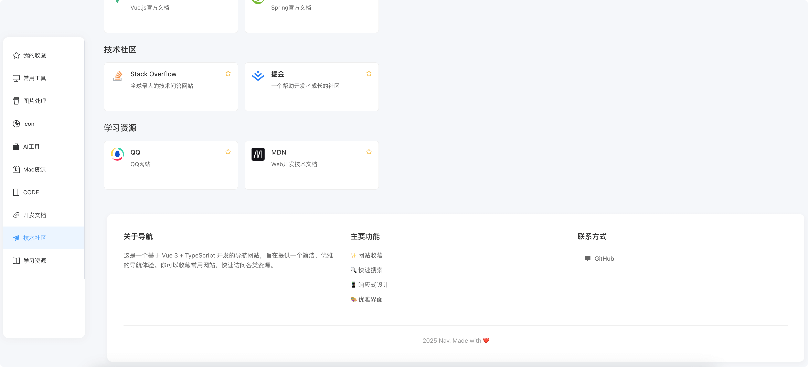

# 网址导航项目

基于 Vue3 + TypeScript + Element Plus 的网址导航项目。

## 功能特点

- 分类展示网址导航
- 快速搜索网站
- 侧边栏快速定位
- 收藏功能（本地存储）

## 预览




## 技术栈

- Vue 3
- TypeScript
- Element Plus
- Tailwind CSS
- Vite
- Pinia

## 开发环境

```bash
# 安装依赖
pnpm install

# 开发
pnpm dev

# 构建
pnpm build
```

## 项目结构

```
src/
├── components/     # 组件
│   ├── WebsiteCard.vue    # 网站卡片组件
│   └── SideNav.vue        # 侧边导航组件
├── views/         # 页面
│   └── home/      # 首页
├── stores/        # 状态管理
│   └── website.ts # 网站收藏状态
├── router/        # 路由
└── types/         # 类型定义
```

## 使用说明

- 点击网站卡片右上角的星标可以收藏/取消收藏
- 收藏的网站会显示在"我的收藏"分类下
- 收藏数据使用 localStorage 存储，刷新页面不会丢失

## 推荐开发工具

- [VSCode](https://code.visualstudio.com/) 
- [Volar](https://marketplace.visualstudio.com/items?itemName=Vue.volar)
